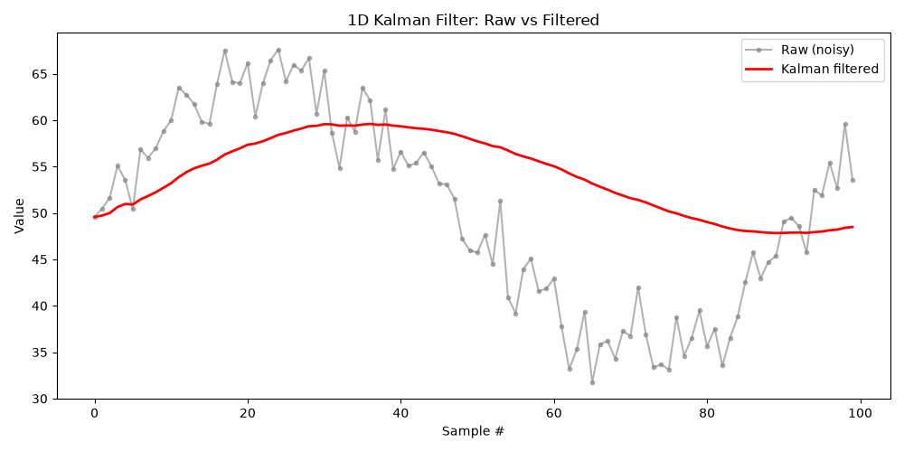

# Kalman Sensor Denoiser

A from-scratch 1D Kalman filter for cleaning up noisy sensor data, built and tuned against real ultrasonic distance readings from a mechatronics radar project.



## Why

Ultrasonic sensors (e.g. the HC-SR04) are cheap and common in robotics, drones, and DIY radar/obstacle-detection builds, but their raw distance readings are jumpy and imprecise. Rather than smoothing the signal with a naive moving average — which lags behind real changes and throws away information — this project implements a Kalman filter: a recursive estimator that fuses each new noisy reading with a running belief about the true state, weighting each by how much it can be trusted.

This is the same class of algorithm used for sensor fusion in autonomous vehicles, drone state estimation, and radar tracking.

## How it works

At each time step the filter runs two stages:

**Predict** — project the previous estimate forward and grow its uncertainty, since no new information has been observed yet.

```
uncertainty = uncertainty + process_variance
```

**Update** — fold in the new measurement, weighted by the Kalman gain, and shrink the uncertainty accordingly.

```
kalman_gain = uncertainty / (uncertainty + measurement_variance)
estimate    = estimate + kalman_gain * (measurement - estimate)
uncertainty = (1 - kalman_gain) * uncertainty
```

The gain automatically balances trust between the sensor and the model: a noisy sensor (high `measurement_variance`) pulls the gain toward 0 and the filter leans on its own prediction, while a confident model with high uncertainty pulls the gain toward 1 and the filter leans on the new reading.

## Project structure

| File | Purpose |
|---|---|
| `kalman_filter.py` | The `KalmanFilter1D` class — predict/update implementation |
| `main.py` | Loads a CSV of readings, runs them through the filter, and plots raw vs. filtered |
| `generate_sample_data.py` | Generates a synthetic noisy signal for testing without real hardware |
| `sample_data.csv` | Example output of the generator, used by default |

## Usage

```bash
pip install -r requirements.txt
python main.py
```

To run it on your own sensor log, supply a CSV with a single numeric column:

```bash
python main.py your_readings.csv distance_cm
```

The column name argument is optional — it defaults to `distance_cm`, or the first column found if that's not present.

## Tuning

Three parameters at the top of `main.py` control the filter's behavior:

- **`process_variance`** — how much the true value is expected to change between readings. Increase it if the filtered output lags behind real movement; decrease it for a smoother line.
- **`measurement_variance`** — how noisy the sensor is. Estimate this empirically by holding the sensor still, logging readings, and computing their variance.
- **`initial_uncertainty`** — confidence in the filter's starting guess. 1.0 works well in practice.

## Next steps

The current implementation tracks a single scalar (position). A natural extension is a multivariate filter with a `[position, velocity]` state vector, which predicts motion between readings instead of assuming a static value — the same structure used in real radar and drone tracking systems.
